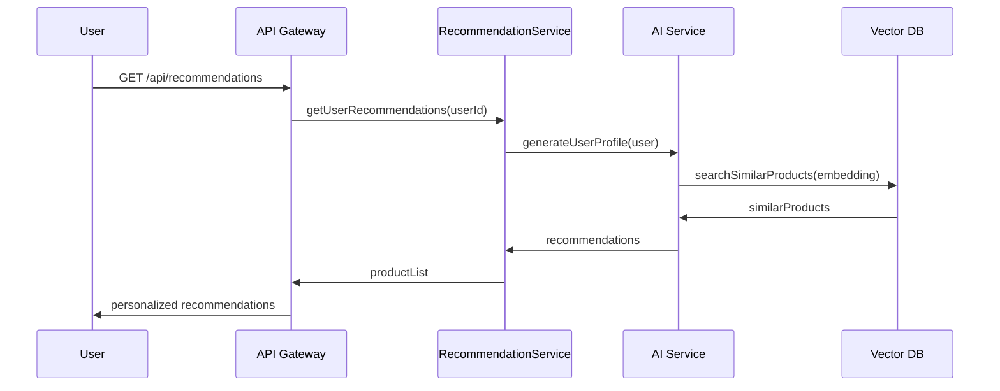
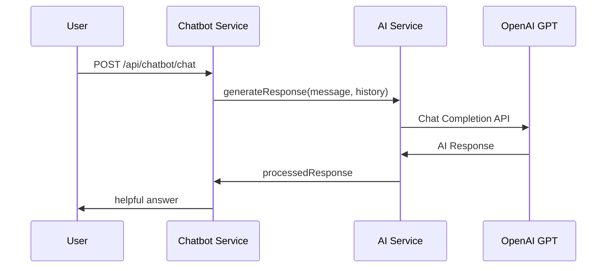
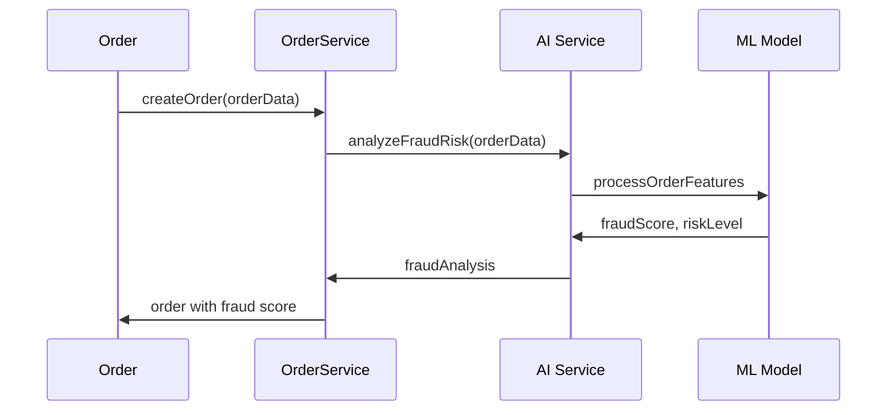

# 🛍️ E-commerce AI Platform

## 📋 Tổng quan

Hệ thống E-commerce tích hợp AI toàn diện với kiến trúc microservices hiện đại, được thiết kế để cung cấp trải nghiệm mua sắm thông minh và cá nhân hóa.

## 🎯 Mục tiêu

- ✅ Hỗ trợ mua sắm thông minh với gợi ý sản phẩm cá nhân hóa
- ✅ Chatbot tư vấn 24/7 tích hợp AI
- ✅ Tối ưu hóa quản lý sản phẩm và xử lý đơn hàng
- ✅ Phát hiện gian lận tự động bằng AI
- ✅ Dự báo tồn kho thông minh
- ✅ Marketing và phân tích hành vi người dùng

## 🏗️ Kiến trúc hệ thống

### Core Services

1. **UserService** - Quản lý người dùng + AI gợi ý cá nhân hóa
2. **ProductService** - Quản lý sản phẩm + AI tự động sinh nội dung
3. **OrderService** - Quản lý đơn hàng + AI phát hiện gian lận
4. **InventoryService** - Quản lý kho + AI dự báo tồn kho
5. **PaymentService** - Xử lý thanh toán + AI phân tích rủi ro
6. **AI Chatbot Service** - Tư vấn 24/7 với GPT/Claude
7. **RecommendationService** - Gợi ý sản phẩm với Vector Search
8. **AI Service Layer** - Tầng trung gian AI với LangChain

### AI Features

- 🤖 **Content Generation**: Tự động tạo mô tả sản phẩm
- 📊 **Recommendation Engine**: Gợi ý sản phẩm cá nhân hóa
- 💬 **Chatbot**: Tư vấn khách hàng 24/7
- 🔍 **Fraud Detection**: Phát hiện gian lận tự động
- 📈 **Inventory Forecasting**: Dự báo tồn kho thông minh
- 🎯 **Behavioral Analysis**: Phân tích hành vi người dùng

## 🛠️ Công nghệ sử dụng

### Backend
- **Java 17** + **Spring Boot 3.5.3**
- **Spring Security** + **JWT** + **OAuth2**
- **MySQL** + **pgvector** (Vector Database)
- **Redis** (Caching & Session)
- **Kafka** (Event Streaming)
- **Elasticsearch** (Search Engine)

### AI Integration
- **OpenAI GPT-4** (Chatbot & Content Generation)
- **Spring AI** (AI Framework)
- **Vector Search** (Recommendation)
- **LangChain** (AI Orchestration)

### Frontend
- **React.js** + **TypeScript**
- **Material-UI** / **Tailwind CSS**
- **Redux Toolkit** (State Management)
- **React Query** (Data Fetching)

### DevOps & Monitoring
- **Docker** + **Docker Compose**
- **Nginx** (Reverse Proxy)
- **Prometheus** + **Grafana** (Monitoring)
- **Jaeger** (Distributed Tracing)
- **MinIO** (Object Storage)

### Payment Integration
- **Stripe** (International)
- **VNPay** (Vietnam)
- **MoMo** (Vietnam)

## 🚀 Cài đặt và chạy

### Yêu cầu hệ thống

- **Java 17+**
- **Docker** & **Docker Compose**
- **Node.js 18+** (cho Frontend)
- **8GB RAM** (tối thiểu)
- **20GB** dung lượng ổ cứng

### 1. Clone repository

```bash
git clone <repository-url>
cd ecommerce-ai-platform
```

### 2. Cấu hình environment variables

Tạo file `.env` trong thư mục root:

```env
# OpenAI Configuration
OPENAI_API_KEY=your-openai-api-key

# Security
JWT_SECRET=your-jwt-secret-key

# OAuth2
GOOGLE_CLIENT_ID=your-google-client-id
GOOGLE_CLIENT_SECRET=your-google-client-secret

# Payment Gateways
STRIPE_API_KEY=your-stripe-api-key
STRIPE_WEBHOOK_SECRET=your-stripe-webhook-secret
VNPAY_MERCHANT_ID=your-vnpay-merchant-id
VNPAY_SECRET_KEY=your-vnpay-secret-key

# Email Service
EMAIL_USERNAME=your-email
EMAIL_PASSWORD=your-email-password
```

### 3. Khởi động các services

```bash
# Khởi động tất cả services
docker-compose up -d

# Chỉ khởi động database và dependencies
docker-compose up -d postgres redis kafka elasticsearch

# Khởi động application
cd project

# Với Gradle (mặc định)
./gradlew bootRun

# Hoặc với Maven
./mvnw spring-boot:run

# Hoặc build và run
./gradlew build && java -jar build/libs/*.jar  # Gradle
./mvnw clean package && java -jar target/*.jar  # Maven
```

### 4. Khởi động Frontend

```bash
cd frontend
npm install
npm start
```

## 📊 Endpoints chính

### Authentication
- `POST /api/auth/register` - Đăng ký
- `POST /api/auth/login` - Đăng nhập
- `POST /api/auth/refresh` - Làm mới token
- `GET /api/auth/oauth2/google` - Đăng nhập Google

### Products
- `GET /api/products` - Danh sách sản phẩm
- `GET /api/products/{id}` - Chi tiết sản phẩm
- `POST /api/products` - Tạo sản phẩm (Admin)
- `PUT /api/products/{id}` - Cập nhật sản phẩm (Admin)
- `GET /api/products/search` - Tìm kiếm sản phẩm

### Orders
- `GET /api/orders` - Danh sách đơn hàng
- `POST /api/orders` - Tạo đơn hàng
- `GET /api/orders/{id}` - Chi tiết đơn hàng
- `PUT /api/orders/{id}/status` - Cập nhật trạng thái

### AI Features
- `GET /api/recommendations` - Gợi ý sản phẩm cá nhân hóa
- `POST /api/chatbot/chat` - Chat với AI
- `POST /api/ai/generate-description` - Tạo mô tả sản phẩm
- `GET /api/ai/fraud-analysis/{orderId}` - Phân tích gian lận

### Analytics
- `GET /api/analytics/dashboard` - Dashboard tổng quan
- `GET /api/analytics/user-behavior` - Phân tích hành vi người dùng
- `GET /api/analytics/sales-report` - Báo cáo bán hàng

## 🔧 Cấu hình Services

### PostgreSQL + pgvector
```yaml
# Cài đặt pgvector extension
CREATE EXTENSION IF NOT EXISTS vector;

        # Tạo index cho vector search
CREATE INDEX product_embedding_idx ON products
USING ivfflat (embedding_vector vector_cosine_ops);
```

### Redis Configuration
```yaml
# Cấu hình caching
spring.cache.type=redis
spring.cache.redis.time-to-live=3600000
```

### Kafka Topics
```bash
# Tạo các topics cần thiết
docker-compose exec kafka kafka-topics --create --topic user-behavior --bootstrap-server kafka:9092
docker-compose exec kafka kafka-topics --create --topic order-events --bootstrap-server kafka:9092
docker-compose exec kafka kafka-topics --create --topic product-events --bootstrap-server kafka:9092
```

## 📱 Monitoring & Management

### Dashboards
- **Grafana**: http://localhost:3000 (admin/admin)
- **Prometheus**: http://localhost:9090
- **Jaeger**: http://localhost:16686
- **pgAdmin**: http://localhost:5050 (admin@ecommerce.com/admin)
- **RabbitMQ**: http://localhost:15672 (admin/admin)
- **MinIO**: http://localhost:9001 (minioadmin/minioadmin)

### Health Checks
```bash
# API Health
curl http://localhost:8080/actuator/health

# Database Health
curl http://localhost:8080/actuator/health/db

# Redis Health
curl http://localhost:8080/actuator/health/redis
```

## 🎯 Luồng hoạt động AI

### 1. Gợi ý sản phẩm cá nhân hóa



### 2. Chatbot tư vấn



### 3. Phát hiện gian lận



## 🔐 Security Features

- **JWT Authentication** với refresh token
- **OAuth2** integration (Google, Facebook)
- **Rate Limiting** chống spam
- **CORS** configuration
- **SQL Injection** protection
- **XSS** prevention
- **CSRF** protection

## 📊 Performance Optimizations

- **Redis Caching** cho dữ liệu thường xuyên truy cập
- **Database Indexing** cho query optimization
- **Lazy Loading** cho JPA relationships
- **Connection Pooling** với HikariCP
- **Async Processing** cho AI operations
- **Vector Search** optimization

## 🧪 Testing

### With Gradle:
```bash
# Unit Tests
./gradlew test

# Integration Tests
./gradlew integrationTest

# API Tests
./gradlew apiTest

# Load Tests
./gradlew loadTest
```

### With Maven:
```bash
# Unit Tests
./mvnw test

# Integration Tests
./mvnw failsafe:integration-test

# Package
./mvnw clean package

# All tests
./mvnw clean verify
```

## ⚖️ Gradle vs Maven

### 📊 Comparison

| Aspect | Gradle | Maven |
|--------|--------|-------|
| **Configuration** | `build.gradle` (100+ lines) | `pom.xml` (400+ lines) |
| **Syntax** | Groovy/Kotlin DSL | XML |
| **Performance** | Faster (incremental builds) | Slower |
| **Learning Curve** | Steeper | Easier |
| **Corporate Adoption** | Growing | Standard |
| **Plugin Ecosystem** | Modern, flexible | Mature, stable |

### 🔄 Migration Commands

| Gradle | Maven |
|--------|-------|
| `./gradlew build` | `./mvnw clean package` |
| `./gradlew bootRun` | `./mvnw spring-boot:run` |
| `./gradlew test` | `./mvnw test` |
| `./gradlew clean` | `./mvnw clean` |
| `./gradlew dependencies` | `./mvnw dependency:tree` |

### 🚀 Switching Build Tools

Dự án đã được setup để hỗ trợ cả Gradle và Maven:

1. **Sử dụng Gradle** (mặc định):
   ```bash
   cd project/project
   ./gradlew bootRun
   ```

2. **Chuyển sang Maven**:
   ```bash
   cd project/project
   ./mvnw spring-boot:run
   ```

3. **Docker với Maven**:
   ```bash
   # Cập nhật docker-compose.yml
   BUILD_TOOL: maven  # thay vì gradle
   ```

## 🚀 Deployment

### Production Docker Compose
```bash
# Production deployment
docker-compose -f docker-compose.prod.yml up -d

# Kubernetes deployment
kubectl apply -f k8s/
```

### Environment Configurations
- **Development**: `application-dev.properties`
- **Staging**: `application-staging.properties`
- **Production**: `application-prod.properties`

## 🤝 Contributing

1. Fork the repository
2. Create your feature branch (`git checkout -b feature/AmazingFeature`)
3. Commit your changes (`git commit -m 'Add some AmazingFeature'`)
4. Push to the branch (`git push origin feature/AmazingFeature`)
5. Open a Pull Request

## 📄 License

This project is licensed under the MIT License - see the [LICENSE](LICENSE) file for details.

## 📞 Support

- 📧 Email: support@ecommerce-ai.com
- 💬 Discord: [Join our community](https://discord.gg/ecommerce-ai)
- 📚 Documentation: [docs.ecommerce-ai.com](https://docs.ecommerce-ai.com)

## 🗺️ Roadmap

### Phase 1 (Completed)
- ✅ Core E-commerce functionality
- ✅ AI integration foundation
- ✅ User management system
- ✅ Product catalog
- ✅ Order management

### Phase 2 (In Progress)
- 🔄 Advanced AI features
- 🔄 Real-time recommendations
- 🔄 Chatbot improvements
- 🔄 Mobile app development
- 🔄 Analytics dashboard

### Phase 3 (Planned)
- 📅 Machine learning models
- 📅 Advanced fraud detection
- 📅 Multi-language support
- 📅 Social commerce features
- 📅 AR/VR integration

## 🌟 Key Features Showcase

### 1. AI-Powered Product Recommendations


### 2. Intelligent Chatbot


### 3. Fraud Detection Dashboard


### 4. Analytics & Insights


---

**Made with ❤️ by the E-commerce AI Team** 